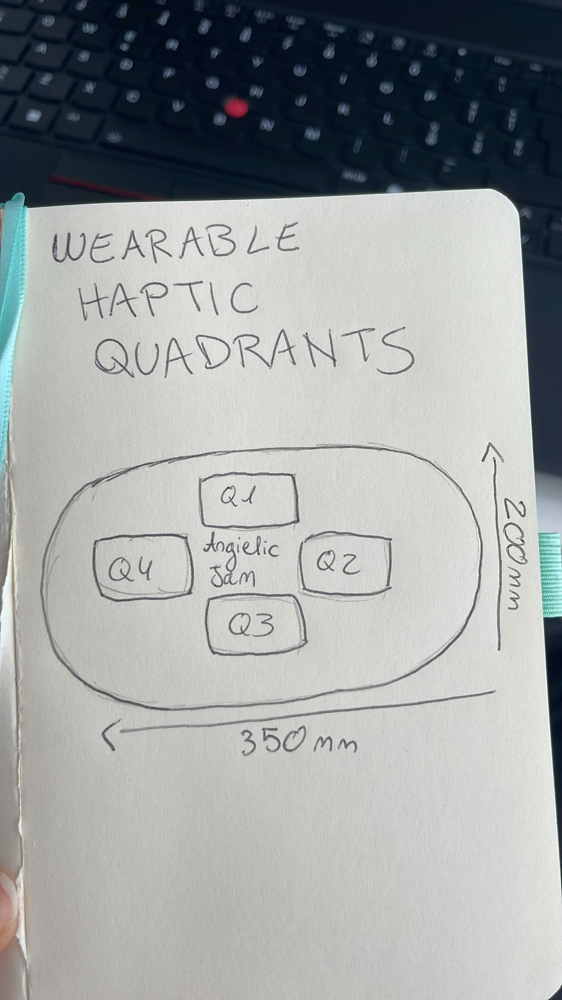

# Auditory and Tactile Interactions 🎶🤝

**Collaborative Acoustic–Tactile Interface for Remote Jam Sessions**

[](./LICENSE)
[]()

---

## 📖 Overview  
This project explores an innovative system that enhances **communication between musicians during remote improvisation sessions**.  
By integrating **auditory and tactile feedback**, the system recreates the sense of physical connection typical of live jam sessions.  

🔗 Live demo (visual prototype only): [Remote Jam Interface Example](https://angieneerangie.github.io/remote-jam/)  

---

## 🛠 Features  
- Real-time **auditory + haptic feedback**  
- **Wearable armband** with 4 quadrants of vibration  
- **Machine learning algorithms** for solo and call-pattern recognition  
- **Universal accessibility support** (hearing/visual impairments)  
- Low-latency synchronization (<22 ms)  

---

## 🖼️ Wearable Haptic Quadrants  
The wearable device is designed with **4 haptic quadrants**, each providing specific musical cues depending on the instrument role.  



- **Q1 (Top)** → Harmonic / Root cues  
- **Q2 (Right)** → Tempo / Solo signals  
- **Q3 (Bottom)** → Rhythmic cues  
- **Q4 (Left)** → Dynamic / Ensemble signals  

Dimensions: `350mm × 200mm`  

---

## 🏗️ System Architecture  
- **Frontend (Mobile/Desktop App)**: Flutter / React Native, FMOD/JUCE, Unity/Three.js  
- **Backend**: Node.js + WebSockets, Redis, PostgreSQL, InfluxDB  
- **Wearable Hardware**: ESP32-S3, DRV2605L haptic driver, Bluetooth 5.2  
- **Machine Learning**: TensorFlow Lite, librosa/essentia  

---

## 🚀 Installation  

```bash
# Clone repository
git clone https://github.com/your-username/remote-jam.git
cd remote-jam

# Install dependencies
npm install   # for backend
flutter pub get   # for mobile app
